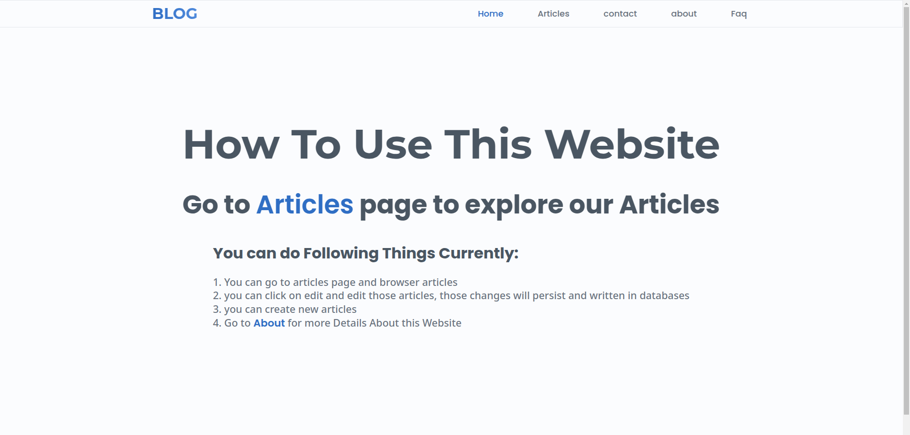
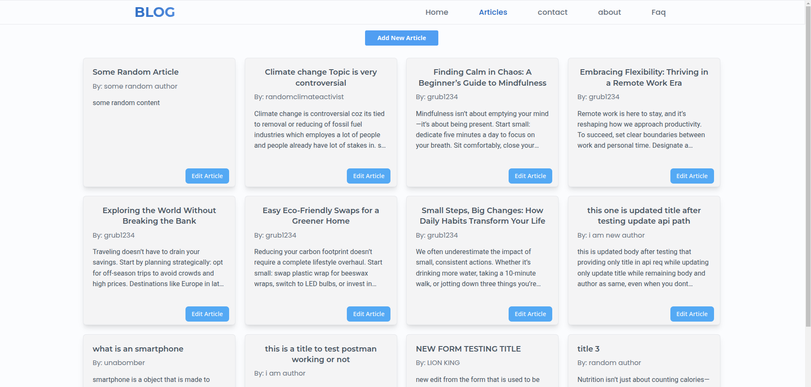
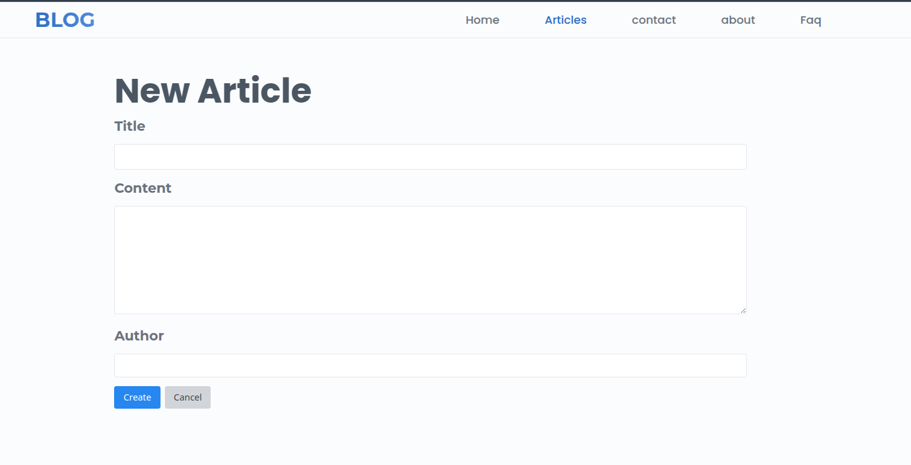
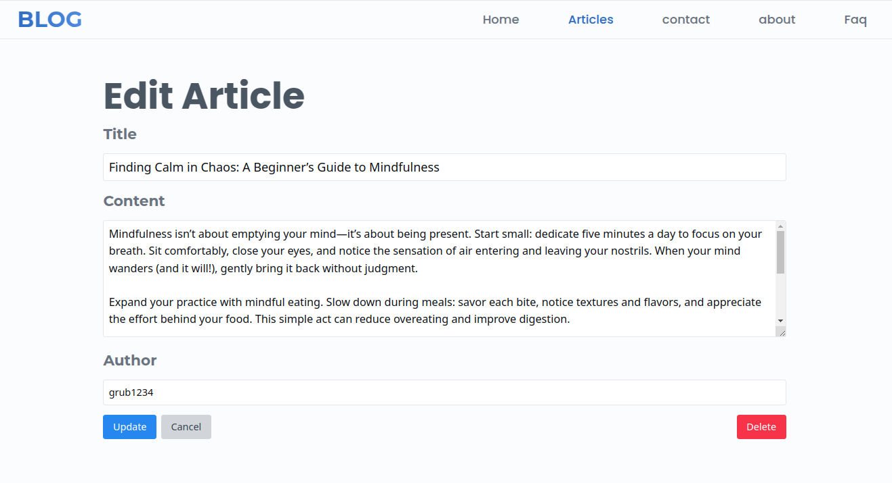
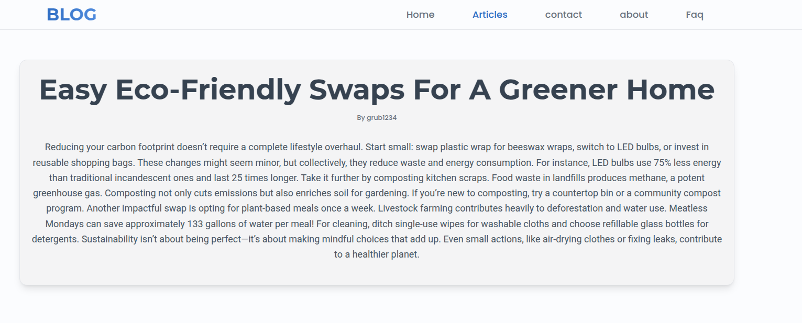
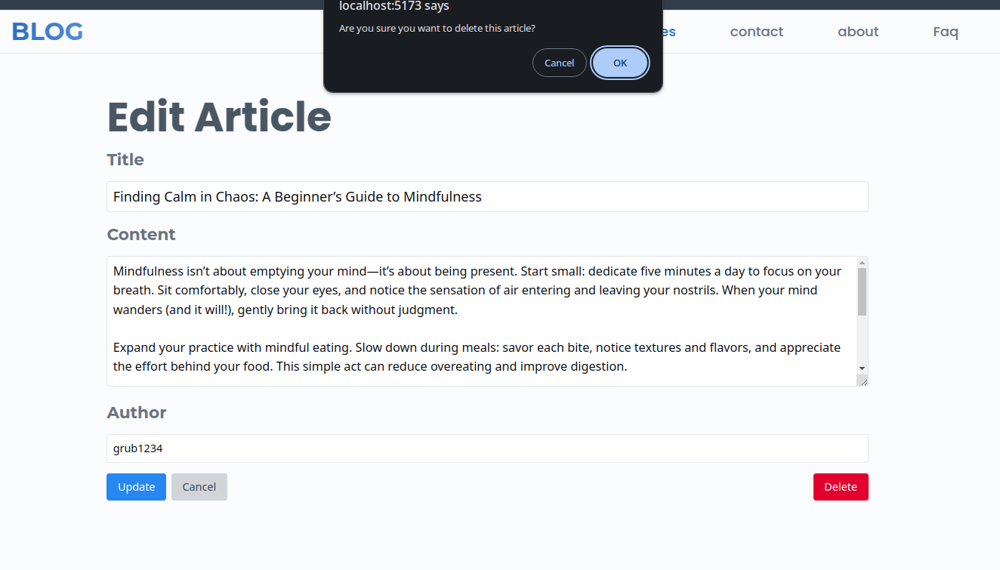
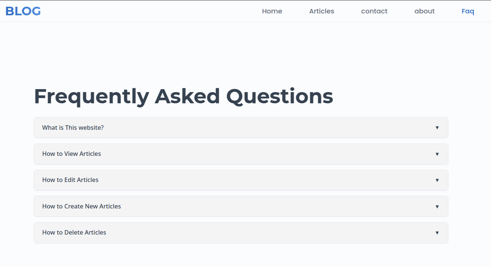

# Blog - Full-Stack Article Application

<!-- add banner image later here: more advice in obs -->
<!--
 Add your banner image -->

A full-stack note-taking application with CRUD functionality, built with React frontend and Node.js/Express backend. Manage articles with rich text content, edit existing notes, and organize your knowledge efficiently.

## Features

- 📝 Create new articles with title, content, and author
- ✏️ Edit existing articles with instant updates
- 🗑️ Delete unwanted articles
- 🔍 View all articles in responsive grid layout
- 📄 Full-page article view
- 🔄 Real-time updates with backend API

 <!-- Add your screenshot -->
_Homepage of the website_

## Tech Stack

**Frontend:**

- React.js
- React Router
- Tailwind CSS
- ReactIcons

**Backend:**

- [Backend-Project-Link](https://github.com/pratishu/mern-blog-app-backend)
  - clone the repo and do `npm i && npm run dev` to install and run the backend
- Node.js
- Express.js
- MongoDB (or your database)
- REST API

## Usage

1.  **View All Articles:**

- Click "Articles" Link in Nav Bar
- view all the Articles in Card Form
   <!-- Add your screenshot -->

2. **Create New Article:**

- Click "New Article" button
- Fill in title, content, and author
- Submit to save
   <!-- Add your screenshot -->

3. **Edit Article:**
    <!-- Add your screenshot -->

   - Click "Edit" button on any article card
   - Modify fields and click Update
   - Changes are saved immediately

4. **View Single Article:**
    <!-- Add your screenshot -->

   - Click "Edit" button on any article card
   - Modify fields and click Update
   - Changes are saved immediately

5. **Delete Article:**
    <!-- Add your screenshot -->

   - In edit mode, click the red Delete button
   - Confirm deletion in the dialog

6. **Faq:**
    <!-- Add your screenshot -->
   - About how this website functions

## Contributing

Contributions are welcome! Follow these steps:

1. Fork the project
2. Create your feature branch (`git checkout -b feature/AmazingFeature`)
3. Commit your changes (`git commit -m 'Add some AmazingFeature'`)
4. Push to the branch (`git push origin feature/AmazingFeature`)
5. Open a Pull Request

## License

Distributed under the MIT License. See `LICENSE` for more information.

## Acknowledgements

- [React Icons](https://react-icons.github.io/react-icons/)
- [Tailwind CSS](https://tailwindcss.com/)
- [React Router DOM](https://reactrouter.com/)
